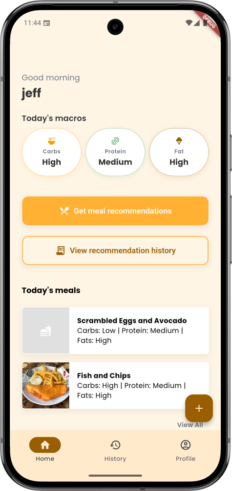

# MyNextMeal

MyNextMeal is a Flutter academic project for recording meals and exploring personalised meal recommendations. It uses Gemini through Firebase AI Logic to analyse food photos and meal descriptions, alongside user preferences and meal history.

## Project status

The project has been submitted. The original backend has been retired from normal app use: its Firebase project is on Spark, Firestore client access is blocked, and Cloud Storage is unavailable on that plan. The checked-in Firebase configuration does not provide a working public demo.

To run your own copy, configure your own Firebase project and Hugging Face token. The app currently depends on online services and does not include an offline demo mode.

## Features

- Email/password and Google sign-in, with password reset.
- User profiles with dietary preferences, restrictions, health goals, and physical metrics.
- Food photo validation and meal analysis from images or text.
- AI-generated ingredient lists, qualitative macronutrient categories, and meal summaries.
- Meal logging, meal history, and personalised recommendations.
- Recommendation history and weight history charts.
- Sentiment analysis of meal feedback using a Hugging Face inference model.

AI-generated meal information is an estimate and can be inaccurate. This is an academic prototype, not a clinically validated nutrition tool.

## Screenshots

| Home | Meal analysis | Recommendations |
| --- | --- | --- |
|  |  |  |

| Meal history | Dietary preferences | Weight history |
| --- | --- | --- |
|  |  |  |

[View the meal analysis summary and feedback screen](docs/images/Meal%20Analysis%20Results%202.png).

## Demo video

Watch the [MyNextMeal walkthrough on YouTube](https://youtu.be/0HeeoZNbi7c).

The recording demonstrates the app before its original backend was retired. Running your own copy requires the setup described below.

## Technology

| Component | Technology |
| --- | --- |
| App | Flutter and Dart |
| State management and navigation | GetX |
| Authentication | Firebase Authentication |
| Meal and profile data | Cloud Firestore |
| Meal images | Cloud Storage for Firebase |
| Meal analysis and recommendations | Firebase AI Logic with the Gemini Developer API |
| Feedback sentiment | Hugging Face Inference |
| Local storage | GetStorage |
| Local credential configuration | Envied |

## Run a personal development copy

These steps describe the required setup; they have not been verified against a fresh Firebase project. Backend rules and service configuration must be supplied separately.

### 1. Install prerequisites

- Flutter with a Dart SDK compatible with `^3.11.1`, as specified in [pubspec.yaml](pubspec.yaml).
- Android Studio and an Android device or emulator for the Android setup below.
- The [Firebase CLI](https://firebase.google.com/docs/cli) and a Firebase account.
- A Hugging Face account with access to the inference provider/model used by the app.

The repository also includes other Flutter platform folders, but their presence does not establish that the app works on those platforms. Desktop Firebase options are not configured, and image handling uses `dart:io`.

Clone or download this repository, open its root directory, and run:

```sh
flutter pub get
firebase login
dart pub global activate flutterfire_cli
```

### 2. Configure your Firebase project

Create a personal Firebase project, then run the following with `YOUR_PROJECT_ID` replaced by its ID:

```sh
flutterfire configure --project=YOUR_PROJECT_ID --platforms=android
```

Verify that `lib/firebase_options.dart`, `android/app/google-services.json`, and the project mappings in `firebase.json` reference your project. The current Android application ID is `com.example.mynextmeal`.

See the official [FlutterFire setup guide](https://firebase.google.com/docs/flutter/setup).

In your Firebase project, configure:

- **Authentication:** Enable Email/Password and Google. Complete the Android signing fingerprint and configuration steps for [Google sign-in](https://firebase.google.com/docs/auth/flutter/federated-auth).
- **Firestore:** Create the default database and deploy rules that restrict each user's access to their own data. The app uses `users/{uid}`, plus `meals` and `recommendations` documents with a `user` ownership field. A blanket rule allowing every signed-in user access is insufficient. Rule files are not currently included in this repository.
- **Storage:** Create a bucket and configure rules appropriate to the image paths used by the app. Full photo functionality requires Blaze under the current [Storage billing requirements](https://firebase.google.com/docs/storage/faqs-storage-changes-announced-sept-2024).
- **Firebase AI Logic:** Follow the [setup guide](https://firebase.google.com/docs/ai-logic/get-started) for the Gemini Developer API. Check the model names in [gemini_controller.dart](lib/services/gemini_controller.dart) against the models available to your project and update them if needed.

Before exposing a running instance to others, configure API restrictions and integrate and enforce App Check as described in the [AI Logic security checklist](https://firebase.google.com/docs/ai-logic/security-checklist). This app does not currently initialise App Check. Review [AI pricing](https://firebase.google.com/docs/ai-logic/pricing) before enabling paid services.

### 3. Configure Hugging Face

Copy [.env.example](.env.example) to a file named `.env` in the project root. Replace its placeholder with your personal token:

```dotenv
HF_API_KEY=your_token_here
```

The inference endpoint and model are defined in [sentiment_analysis.dart](lib/features/meals/sentiment_analysis.dart). Ensure your token has the permissions required to call that provider and model.

Generate the local Envied code:

```sh
dart run build_runner build --delete-conflicting-outputs
```

This generates `lib/env.g.dart`. Both `.env` and generated `*.g.dart` files are ignored by Git. Regenerate the code after changing the token. See the [Envied documentation](https://pub.dev/packages/envied).

Envied obfuscation does not make an embedded token secret. Use personal development credentials locally; a distributed app should call Hugging Face through a backend that keeps the token server-side.

### 4. Launch

Start your Android emulator or connect a device, then run:

```sh
flutter run
```

The existing Android release configuration uses debug signing. Configure your own release signing before distributing a production build.

## Code structure

| Path | Purpose |
| --- | --- |
| `lib/main.dart` | Firebase initialisation and controller registration |
| `lib/screens/` | App screens |
| `lib/features/auth/` | Authentication controllers |
| `lib/features/meals/` | Meal analysis, history, recommendations, and feedback |
| `lib/features/user/` | User profiles and data access |
| `lib/services/` | Gemini model configuration and network handling |
| `lib/utils/` | Themes, constants, validation, and shared helpers |
| `assets/` | Fonts, icons, and logos |
